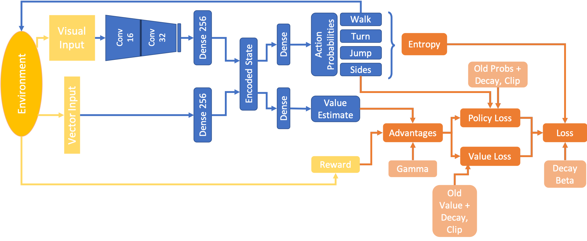
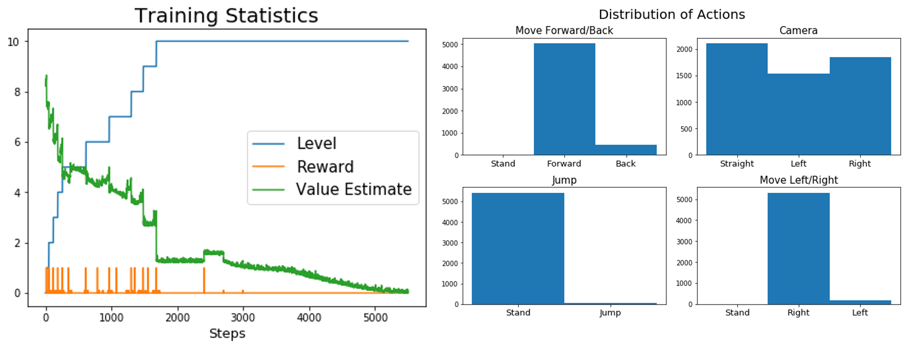

# Obstacle Tower Challenge - Agent Analysis

The following results have been obtained from an agent trained for the [Unity Obstacle Tower Challenge](https://www.aicrowd.com/challenges/unity-obstacle-tower-challenge). The agent needs to navigate a maze of rooms to get to a door which leads him one floor up. On the wa he can collect blue spheres which supply more time. Starting at level 5, the agent needs to find and pick up a key in order to open certain doors. Starting from level 10, the agent needs to solve puzzles in which he is supposed to push a box onto a designated area for a door to open. The agent shown here can't achive this yet.

## The Agents Brain and How it Learns
I use proximal policy optimization (PPO) to train the agent. Figure 1 shows the underlying network structure (blue). The agent makes decisions based on visual and vector observations provided by the environment (yellow). Vector observations are composed of the time left, the number of key which the agent possesses and the level in which he finds himself.

We will now look at the agents brain in one particular run. Figure 2 shows the overall statistics of this run. You can see that the agent reached level 10 within less than 2000 steps.

## Activity in the Agents Brain
The following animation shows the embedded layer activations in the agents brain (left) with the corresponding visual observations (right) and the actions which the agent selects. R and V display the obtained reward from the environment and the value estimate respectively.

<iframe width="600" height="300" frameborder="0" scrolling="no" src="content/anim_encodings.html" align="center"></iframe>

<iframe width="600" height="700" frameborder="0" scrolling="no" src="content/anim_correlations.html" align="center"></iframe>
