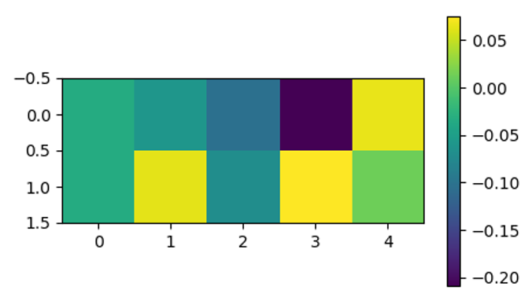

# Obstacle Tower Challenge - Agent Analysis

The following results have been obtained from an agent trained for the [Unity Obstacle Tower Challenge](https://www.aicrowd.com/challenges/unity-obstacle-tower-challenge). The agent needs to navigate a maze of rooms to get to a door which leads him one floor up. On the wa he can collect blue spheres which supply more time. Starting at level 5, the agent needs to find and pick up a key in order to open certain doors. Starting from level 10, the agent needs to solve puzzles in which he is supposed to push a box onto a designated area for a door to open. The agent shown here can't achive this yet.

## The Agents Brain and How it Learns
I use proximal policy optimization (PPO) to train the agent. Figure 1 shows the underlying network structure (blue). The agent makes decisions based on visual and vector observations provided by the environment (yellow). Vector observations are composed of the time left, the number of key which the agent possesses and the level in which he finds himself.

We will now look at the agents brain in one particular run. Figure 2 shows the overall statistics of this run. You can see that the agent reached level 10 within less than 2000 steps.

## Activity in the Agents Brain
The following animation shows the embedded layer activations in the agents brain (left) with the corresponding visual observations (right) and the actions which the agent selects. R and V display the obtained reward from the environment and the value estimate respectively.

<iframe width="600" height="300" frameborder="0" scrolling="no" src="content/anim_encodings.html" align="center"></iframe>

## K-Means Clustering on the Activations
In Figure 3 you can see the distribution on images into 10 clusters calculated with k-means clustering. When looking at the images in the different clusters one can make out some semantic patterns. Some cluster contain images where the agent walks through doors or sees other rewarding events coming such as blue spheres or keys, other clusters contain frames where the agent walks into walls while others contain jumping or right/left turns.

XX insert interactive element here

## PCA on the Activations
Principal component analysis reveals quite a lot of variance in the activations. The first three components explain only 46.68% of the variance and even 20 principal components can explain only 85.57% of the variance.

## ICA on the Activations
In the animation below you can see the results of an independent component analysis on the network activations. The independent components are shown on the left, paired the the corresponding observations on the right.

XX insert ICA video Here

In figure 4 you can see the correlation between the IC values and the value estimate. Overall the correlation isn't very strong.

## Correlation Between Activations and Value Estimate
In figure 5 you can see the correlation between the neuron activations in the hidden layer and the value estimate.

When looking at the most correlated neuron in the visual part of the embedding one can se spikes in the neuron strongly correlated with going through level doors or obtaining other rewards.

XX insert interactive graph here.

When we now look at the visual observations that lead to this neuron being activated we can see that a lot of these observations contain doors and spheres.

XX insert corr neuron animation Here

## Embeddings Correlated with Actions
Figure 7 shows the correlation between network activations and the four action branches. You can see a stronger correlation with the visual part of the embedding than the vector part.

## Correlations of Neurons With Each Other
In this display you can see the correlation of each neuron with all the other neurons. If you want to see the visual observations which led to the selected neuron being active click on the button "Active Frames" and they will appear in the display below.

<iframe width="600" height="700" frameborder="0" scrolling="no" src="content/anim_correlations.html" align="center"></iframe>
