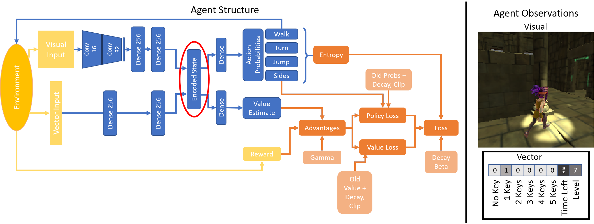

# Learning Semantically Meaningful Representations Through Embodiment

The following results have been obtained from an agent trained for the <a href="https://www.aicrowd.com/challenges/unity-obstacle-tower-challenge" target="_blank"> Unity Obstacle Tower Challenge </a>. The agent needs to navigate a maze of rooms to get to a door which leads him one floor up. On the way he can collect blue spheres which supply more time. Starting at level 5, the agent needs to find and pick up a key in order to open certain doors. Starting from level 10, the agent needs to solve puzzles in which he is supposed to push a box onto a designated area for a door to open. The agent shown here can't achieve this yet.

<a href="RL-Encodings-Notebook.html" target="_blank"> Here </a> you can find the Jupyter Notebook used to generate the following figures and animations.

<iframe width="560" height="315" src="https://www.youtube.com/embed/ppRLisL9WbM" frameborder="0" allow="accelerometer; autoplay; encrypted-media; gyroscope; picture-in-picture" allowfullscreen></iframe>

## The Agents Brain and How it Learns
I use proximal policy optimization (PPO) to train the agent. Figure 1 shows the underlying network structure (blue). The agent makes decisions based on visual and vector observations provided by the environment (yellow). Vector observations are composed of the time left, the number of key which the agent possesses and the level in which he finds himself.

We will now look at the agents brain in one particular run. Figure 2 shows the overall statistics of this run. You can see that the agent reached level 10 within less than 2000 steps.

## Activity in the Agents Brain
The following animation shows the embedded layer activations in the agents brain (left) with the corresponding visual observations (right) and the actions which the agent selects. R and V display the obtained reward from the environment and the value estimate respectively.

<iframe width="100%" height="350" frameborder="0" scrolling="auto" src="content/anim_encodings.html"></iframe>

## K-Means Clustering on the Visual Activations
In the figure below (left) you can see the distribution of images in the 6 clusters calculated with k-means clustering. On the right you can see the within class variance for each cluster. The clustering is performed on the embedding of the visual observations (256 dimensions). When looking at the images in the different clusters one can make out some semantic patterns. Some cluster contain images where the agent walks through doors or sees other rewarding events coming such as blue spheres or keys (for instance see cluster 5), other clusters contain frames where the agent simply walks through rooms (cluster 1) while others for example contain hard right/left turns or backwards motion (cluster 2). Feel free to also explore the images in the 6 class clustering (number of cluster with least within class variance).

<iframe width="100%" height="1000" frameborder="0" scrolling="auto" src="content/anim_k-means.html"></iframe>

In the figure below one can see that the clusters don't only have a meaningful structure in regard to the actions they contain but also the content of the image. One can see that for example the information if a level door is observed is represented in the visual encoding and in this clustering those frames are mainly placed within cluster 5.

## T-SNE on the Visual Embeddings
Hover with your curser over the data points to see the corresponding observations of the agent for each point.

<iframe width="100%" height="750" frameborder="0" scrolling="auto" src="content/tsne.html"></iframe>

## PCA on the Activations in the Visual Embedding
Principal component analysis reveals quite a lot of variance in the activations. The first three components explain only 46.68% of the variance and even 20 principal components can explain only 85.57% of the variance.

When looking at the K-Means clustered data projected onto the principal component one can see somehow distinct point clouds.

## Correlation Between Embeddings and Value Estimate

In figure 7 you can see the correlation between the neuron activations in the hidden layer and the value estimate.

When looking at the most correlated neuron in the visual part of the embedding one can se spikes in the neuron strongly correlated with going through level doors or obtaining other rewards.

<iframe width="100%" height="550" frameborder="0" scrolling="auto" src="content/most_cor.html"></iframe>

When we now look at the visual observations that lead to this neuron being activated we can see that a lot of these observations contain doors and spheres.

<iframe width="100%" height="350" frameborder="0" scrolling="auto" src="content/anim_most_corr.html"></iframe>

## Embeddings Correlated with Actions

Figure 8 shows the correlation between network activations and the four action branches. You can see a stronger correlation with the visual part of the embedding than the vector part.

## Correlations of Neurons With Each Other
In this display you can see the correlation of each neuron with all the other neurons. If you want to see the visual observations which led to the selected neuron being active click on the button "Active Frames" and they will appear in the display below.

<iframe width="100%" height="700" frameborder="0" scrolling="auto" src="content/anim_correlations.html"></iframe>

